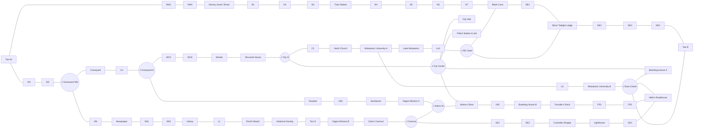

# Arkham Horror – detailne mänguraja graaf arvutimängu jaoks

Allikas: kasutaja antud mängulaua pilt (`game board full A2.pdf`, lk 1).

> Eesmärk: muuta laual nähtav rada arvutimängus kasutatavaks **graafiks**, kus iga nimeline koht, tühi rajakoht ja hargnemine on eraldi sõlm ning iga naabersõlmede ühendus on üks serv / üks liikumissamm.
>
> Märkus: allolev graaf on koostatud pildi visuaalse analüüsi põhjal. Kõige kindlamad on nimega kohtade omavaheline järjestus ning selgelt nähtavad rajavahed. Mõne suure hargnemisala täpne geomeetriline jaotus on märgitud `VERIFY`, sest illustratsioon katab osaliselt rajajoont. Arvutimängu implementatsioonis soovitan need 1:1 taustapildi peale tõstes üle kontrollida.

---

## 1. Andmemudel

Soovituslik sõlmetüüp:

```ts
type BoardNode = {
  id: string;
  type: "location" | "space" | "junction" | "transport";
  label?: string;
  aliases?: string[];
  x?: number; // 0..1 normaliseeritud lauakoordinaat
  y?: number; // 0..1 normaliseeritud lauakoordinaat
  verify?: boolean;
};

type BoardEdge = {
  a: string;
  b: string;
  cost: 1;
};
```

Kõik allpool toodud servad on **kahesuunalised**.

---

## 2. ID-de loogika

- `LOC_*` – nimeline koht.
- `TAXI_*` – taksokoht.
- `S_*` – tühi rajakoht.
- `J_*` – hargnemine / ristmik.
- `_A`, `_B` – sama nimega koha erinevad sissepääsud/rajasegmendid.

Sama nimega kohtade puhul tuleb säilitada eri node'id, sest laual on näiteks mitu `Miskatonic University`, `Boarding House` ja `Dagon Mission` tähisega rajasegmenti.

---

# 3. Põhjapoolne välimine rada

## 3.1 Harvey Jones' Shack ↔ lääne Taxi

Pildil on nende vahel **2 tühja rajakohta**.

```text
TAXI_W
  ─ S_NW_01
  ─ S_NW_02
  ─ LOC_HARVEY_JONES_SHACK
```

Servad:

```yaml
- [TAXI_W, S_NW_01]
- [S_NW_01, S_NW_02]
- [S_NW_02, LOC_HARVEY_JONES_SHACK]
```

Seega:

- `blank_spaces_between = 2`
- `movement_edges = 3`

---

## 3.2 Harvey Jones' Shack ↔ Train Station

Pildil on nende vahel **3 tühja rajakohta**.

```text
LOC_HARVEY_JONES_SHACK
  ─ S_N_01
  ─ S_N_02
  ─ S_N_03
  ─ LOC_TRAIN_STATION
```

Servad:

```yaml
- [LOC_HARVEY_JONES_SHACK, S_N_01]
- [S_N_01, S_N_02]
- [S_N_02, S_N_03]
- [S_N_03, LOC_TRAIN_STATION]
```

---

## 3.3 Train Station ↔ Black Cave

Visuaalselt on sellel pikemal lõigul **4 tühja rajakohta**.

```text
LOC_TRAIN_STATION
  ─ S_N_04
  ─ S_N_05
  ─ S_N_06
  ─ S_N_07
  ─ LOC_BLACK_CAVE
```

```yaml
- [LOC_TRAIN_STATION, S_N_04]
- [S_N_04, S_N_05]
- [S_N_05, S_N_06]
- [S_N_06, S_N_07]
- [S_N_07, LOC_BLACK_CAVE]
```

> `VERIFY`: Black Cave lähedal ühendub sisemine kiriku / ülikooli piirkonna rada. Seda ühendust käsitletakse all eraldi hargnemisena.

---

## 3.4 Black Cave ↔ Silver Twilight Lodge

```text
LOC_BLACK_CAVE
  ─ S_NE_01
  ─ LOC_SILVER_TWILIGHT_LODGE
```

```yaml
- [LOC_BLACK_CAVE, S_NE_01]
- [S_NE_01, LOC_SILVER_TWILIGHT_LODGE]
```

---

## 3.5 Silver Twilight Lodge ↔ idapoolne Taxi

```text
LOC_SILVER_TWILIGHT_LODGE
  ─ S_NE_02
  ─ S_NE_03
  ─ S_NE_04
  ─ TAXI_E
```

```yaml
- [LOC_SILVER_TWILIGHT_LODGE, S_NE_02]
- [S_NE_02, S_NE_03]
- [S_NE_03, S_NE_04]
- [S_NE_04, TAXI_E]
```

---

# 4. Läänekaar: Taxi → Graveyard → alumine linn

## 4.1 Lääne Taxi ↔ Graveyardi piirkond

```text
TAXI_W
  ─ S_W_01
  ─ S_W_02
  ─ J_GRAVEYARD_NW
```

```yaml
- [TAXI_W, S_W_01]
- [S_W_01, S_W_02]
- [S_W_02, J_GRAVEYARD_NW]
```

`J_GRAVEYARD_NW` juures jaguneb rada:

1. ida / Graveyard;
2. lõuna / Newspaper;
3. tagasi põhja / Taxi.

```text
                   TAXI_W
                     │
                  S_W_01
                     │
                  S_W_02
                     │
              J_GRAVEYARD_NW
                /          \
       LOC_GRAVEYARD      S_NEWSPAPER_N
                            │
                      LOC_NEWSPAPER
```

---

## 4.2 Graveyardi haru

```text
J_GRAVEYARD_NW
  ─ LOC_GRAVEYARD
  ─ S_GRAVE_01
  ─ J_GRAVEYARD_E
```

```yaml
- [J_GRAVEYARD_NW, LOC_GRAVEYARD]
- [LOC_GRAVEYARD, S_GRAVE_01]
- [S_GRAVE_01, J_GRAVEYARD_E]
```

`J_GRAVEYARD_E` on ühendus keskmise läänerajaga.

---

# 5. Graveyard / Hospital / Sanitarium / Dagon Mission

Pildi järgi kulgeb keskmine lääne-lõuna rada järgmises järjestuses:

```text
J_GRAVEYARD_E
  ─ LOC_HOSPITAL
  ─ S_HS_01
  ─ LOC_SANITARIUM
  ─ LOC_DAGON_MISSION_A
  ─ J_VELMA_W
```

```yaml
- [J_GRAVEYARD_E, LOC_HOSPITAL]
- [LOC_HOSPITAL, S_HS_01]
- [S_HS_01, LOC_SANITARIUM]
- [LOC_SANITARIUM, LOC_DAGON_MISSION_A]
- [LOC_DAGON_MISSION_A, J_VELMA_W]
```

> `VERIFY`: Hospitali ja Sanitariumi vahelise ühe tühja segmendi piir on pildil selge, kuid Graveyardi idapoolse ristmiku täpne node'i kuju tasub taustapildi peal üle kontrollida.

---

# 6. Woods / Shunned House / City Hall põhjaühendus

## 6.1 Graveyardi ülemine haru → Woods

```text
J_GRAVEYARD_E
  ─ S_WOODS_01
  ─ S_WOODS_02
  ─ LOC_WOODS
  ─ LOC_SHUNNED_HOUSE
  ─ J_CITY_N
```

```yaml
- [J_GRAVEYARD_E, S_WOODS_01]
- [S_WOODS_01, S_WOODS_02]
- [S_WOODS_02, LOC_WOODS]
- [LOC_WOODS, LOC_SHUNNED_HOUSE]
- [LOC_SHUNNED_HOUSE, J_CITY_N]
```

`J_CITY_N` ühendab kolm suunda:

```text
                   põhjarada / Black Cave suund
                           │
                        J_CITY_N
                        /      \
          SHUNNED HOUSE        North Church / City Hall
```

`VERIFY`: täpne lahknemine on osaliselt hoonete illustratsiooni all.

---

# 7. City Halli keskne sõlm

City Halli ümbrus on kõige olulisem kesksõlm.

Kasutame eraldi junction-node'i:

```text
J_CITY_CENTER
```

Sinna ühenduvad:

```yaml
- [J_CITY_N, J_CITY_CENTER]
- [J_CITY_CENTER, LOC_CITY_HALL]
- [J_CITY_CENTER, LOC_POLICE_STATION_JAIL]
- [J_CITY_CENTER, LOC_BOARDING_HOUSE_A]
- [J_CITY_CENTER, LOC_VELMAS_DINER]
```

Topoloogiliselt:

```text
                   J_CITY_N
                      │
                J_CITY_CENTER
               /   /   |    \
              /   /    |     \
     CITY HALL  POLICE  |   BOARDING HOUSE A
                        |
                  VELMA'S DINER
```

> Arvutimängus tasub `J_CITY_CENTER` hoida eraldi node'ina isegi siis, kui graafika järgi tundub see lihtsalt laiem rajasegment. See teeb pathfinding'u ja harude haldamise palju puhtamaks.

---

# 8. North Church / Miskatonic University / Lake Miskatonic

```text
J_CITY_N
  ─ S_CHURCH_01
  ─ LOC_NORTH_CHURCH
  ─ LOC_MISKATONIC_UNIVERSITY_A
  ─ LOC_LAKE_MISKATONIC
  ─ S_LAKE_01
  ─ J_NE_OUTER
```

```yaml
- [J_CITY_N, S_CHURCH_01]
- [S_CHURCH_01, LOC_NORTH_CHURCH]
- [LOC_NORTH_CHURCH, LOC_MISKATONIC_UNIVERSITY_A]
- [LOC_MISKATONIC_UNIVERSITY_A, LOC_LAKE_MISKATONIC]
- [LOC_LAKE_MISKATONIC, S_LAKE_01]
- [S_LAKE_01, J_NE_OUTER]
```

`J_NE_OUTER` ühendab selle haru põhja-/idapoolse välisrajaga Silver Twilight Lodge / Black Cave piirkonnas.

> `VERIFY`: välisrajaga ühenduse täpne segment tuleb taustapildilt koordinaatide määramisel üle kontrollida.

---

# 9. Miskatonic University alumine haru

Laual on teine `Miskatonic University` tähisega rajasegment.

```text
LOC_MISKATONIC_UNIVERSITY_A
  ─ S_UNI_01
  ─ LOC_MISKATONIC_UNIVERSITY_B
  ─ J_EAST_CENTER
```

```yaml
- [LOC_MISKATONIC_UNIVERSITY_A, S_UNI_01]
- [S_UNI_01, LOC_MISKATONIC_UNIVERSITY_B]
- [LOC_MISKATONIC_UNIVERSITY_B, J_EAST_CENTER]
```

`J_EAST_CENTER` ühendab:

- Miskatonic University B;
- City Hall / Boarding House suuna;
- Hibb's Roadhouse suuna;
- idapoolse Taxi / välisraja.

```yaml
- [J_EAST_CENTER, TAXI_E]
- [J_EAST_CENTER, LOC_BOARDING_HOUSE_A]
```

> `VERIFY`: Taxi E ja `J_EAST_CENTER` vahel on pildil mitu eraldatud segmenti. Implementatsioonis loo vajadusel `S_E_01`, `S_E_02` vastavalt taustapildi täpsele piirile.

---

# 10. Velma's Diner / Boarding House / Founder's Rock

```text
J_VELMA_W
  ─ LOC_VELMAS_DINER
  ─ S_VB_01
  ─ LOC_BOARDING_HOUSE_B
  ─ LOC_FOUNDERS_ROCK
  ─ S_FR_01
  ─ S_FR_02
  ─ LOC_HIBS_ROADHOUSE
```

```yaml
- [J_VELMA_W, LOC_VELMAS_DINER]
- [LOC_VELMAS_DINER, S_VB_01]
- [S_VB_01, LOC_BOARDING_HOUSE_B]
- [LOC_BOARDING_HOUSE_B, LOC_FOUNDERS_ROCK]
- [LOC_FOUNDERS_ROCK, S_FR_01]
- [S_FR_01, S_FR_02]
- [S_FR_02, LOC_HIBS_ROADHOUSE]
```

Lisaks:

```yaml
- [LOC_VELMAS_DINER, J_CITY_CENTER]
- [LOC_HIBS_ROADHOUSE, J_EAST_CENTER]
```

See moodustab olulise **keskmise ida-lääne ühenduse**.

---

# 11. Newspaper / Library / alumine läänerada

```text
J_GRAVEYARD_NW
  ─ S_NEWSPAPER_N
  ─ LOC_NEWSPAPER
  ─ S_NEWSPAPER_S1
  ─ S_NEWSPAPER_S2
  ─ LOC_LIBRARY
  ─ S_LIB_01
  ─ LOC_DEVILS_BEACH
  ─ LOC_HISTORICAL_SOCIETY
  ─ TAXI_S
  ─ LOC_DAGON_MISSION_B
  ─ LOC_DARKS_CARNIVAL
  ─ J_CARNIVAL
```

```yaml
- [J_GRAVEYARD_NW, S_NEWSPAPER_N]
- [S_NEWSPAPER_N, LOC_NEWSPAPER]
- [LOC_NEWSPAPER, S_NEWSPAPER_S1]
- [S_NEWSPAPER_S1, S_NEWSPAPER_S2]
- [S_NEWSPAPER_S2, LOC_LIBRARY]
- [LOC_LIBRARY, S_LIB_01]
- [S_LIB_01, LOC_DEVILS_BEACH]
- [LOC_DEVILS_BEACH, LOC_HISTORICAL_SOCIETY]
- [LOC_HISTORICAL_SOCIETY, TAXI_S]
- [TAXI_S, LOC_DAGON_MISSION_B]
- [LOC_DAGON_MISSION_B, LOC_DARKS_CARNIVAL]
- [LOC_DARKS_CARNIVAL, J_CARNIVAL]
```

`J_CARNIVAL` on oluline hargnemine:

```text
                       Velma / City Hall
                            │
                       J_CARNIVAL
                      /          \
            Dark's Carnival      kagurada
```

```yaml
- [J_CARNIVAL, J_VELMA_W]
```

---

# 12. Kagurada: Carnival → Curiositie Shoppe → Lighthouse → Hibb's

```text
J_CARNIVAL
  ─ S_SE_01
  ─ S_SE_02
  ─ LOC_CURIOSITIE_SHOPPE
  ─ LOC_LIGHTHOUSE
  ─ S_SE_03
  ─ LOC_HIBS_ROADHOUSE
```

```yaml
- [J_CARNIVAL, S_SE_01]
- [S_SE_01, S_SE_02]
- [S_SE_02, LOC_CURIOSITIE_SHOPPE]
- [LOC_CURIOSITIE_SHOPPE, LOC_LIGHTHOUSE]
- [LOC_LIGHTHOUSE, S_SE_03]
- [S_SE_03, LOC_HIBS_ROADHOUSE]
```

See moodustab alumise idaosa väikese ringi koos Founder's Rocki haruga.

---

# 13. Kõik nimelised node'id

```yaml
locations:
  - LOC_HARVEY_JONES_SHACK
  - LOC_TRAIN_STATION
  - LOC_BLACK_CAVE
  - LOC_SILVER_TWILIGHT_LODGE
  - TAXI_W
  - TAXI_E
  - TAXI_S
  - LOC_GRAVEYARD
  - LOC_WOODS
  - LOC_SHUNNED_HOUSE
  - LOC_HOSPITAL
  - LOC_SANITARIUM
  - LOC_DAGON_MISSION_A
  - LOC_CITY_HALL
  - LOC_POLICE_STATION_JAIL
  - LOC_BOARDING_HOUSE_A
  - LOC_VELMAS_DINER
  - LOC_NORTH_CHURCH
  - LOC_MISKATONIC_UNIVERSITY_A
  - LOC_LAKE_MISKATONIC
  - LOC_MISKATONIC_UNIVERSITY_B
  - LOC_NEWSPAPER
  - LOC_LIBRARY
  - LOC_DEVILS_BEACH
  - LOC_HISTORICAL_SOCIETY
  - LOC_DAGON_MISSION_B
  - LOC_DARKS_CARNIVAL
  - LOC_BOARDING_HOUSE_B
  - LOC_FOUNDERS_ROCK
  - LOC_HIBS_ROADHOUSE
  - LOC_CURIOSITIE_SHOPPE
  - LOC_LIGHTHOUSE
```

---

# 14. Junction-node'id

```yaml
junctions:
  J_GRAVEYARD_NW:
    connects:
      - S_W_02
      - LOC_GRAVEYARD
      - S_NEWSPAPER_N

  J_GRAVEYARD_E:
    connects:
      - S_GRAVE_01
      - LOC_HOSPITAL
      - S_WOODS_01

  J_CITY_N:
    connects:
      - LOC_SHUNNED_HOUSE
      - J_CITY_CENTER
      - S_CHURCH_01

  J_CITY_CENTER:
    connects:
      - J_CITY_N
      - LOC_CITY_HALL
      - LOC_POLICE_STATION_JAIL
      - LOC_BOARDING_HOUSE_A
      - LOC_VELMAS_DINER

  J_VELMA_W:
    connects:
      - LOC_DAGON_MISSION_A
      - LOC_VELMAS_DINER
      - J_CARNIVAL

  J_NE_OUTER:
    connects:
      - S_LAKE_01
      - LOC_BLACK_CAVE
      - LOC_SILVER_TWILIGHT_LODGE
    verify: true

  J_EAST_CENTER:
    connects:
      - LOC_MISKATONIC_UNIVERSITY_B
      - TAXI_E
      - LOC_BOARDING_HOUSE_A
      - LOC_HIBS_ROADHOUSE
    verify: true

  J_CARNIVAL:
    connects:
      - LOC_DARKS_CARNIVAL
      - J_VELMA_W
      - S_SE_01
```

---

# 15. Masinloetav servaloend

Seda blokki saab peaaegu otse TypeScripti / JavaScripti importida pärast jutumärkide lisamist.

```yaml
edges:
  # NW / NORTH
  - [TAXI_W, S_NW_01]
  - [S_NW_01, S_NW_02]
  - [S_NW_02, LOC_HARVEY_JONES_SHACK]
  - [LOC_HARVEY_JONES_SHACK, S_N_01]
  - [S_N_01, S_N_02]
  - [S_N_02, S_N_03]
  - [S_N_03, LOC_TRAIN_STATION]
  - [LOC_TRAIN_STATION, S_N_04]
  - [S_N_04, S_N_05]
  - [S_N_05, S_N_06]
  - [S_N_06, S_N_07]
  - [S_N_07, LOC_BLACK_CAVE]
  - [LOC_BLACK_CAVE, S_NE_01]
  - [S_NE_01, LOC_SILVER_TWILIGHT_LODGE]
  - [LOC_SILVER_TWILIGHT_LODGE, S_NE_02]
  - [S_NE_02, S_NE_03]
  - [S_NE_03, S_NE_04]
  - [S_NE_04, TAXI_E]

  # WEST / GRAVEYARD
  - [TAXI_W, S_W_01]
  - [S_W_01, S_W_02]
  - [S_W_02, J_GRAVEYARD_NW]
  - [J_GRAVEYARD_NW, LOC_GRAVEYARD]
  - [LOC_GRAVEYARD, S_GRAVE_01]
  - [S_GRAVE_01, J_GRAVEYARD_E]

  # HOSPITAL / SANITARIUM / DAGON
  - [J_GRAVEYARD_E, LOC_HOSPITAL]
  - [LOC_HOSPITAL, S_HS_01]
  - [S_HS_01, LOC_SANITARIUM]
  - [LOC_SANITARIUM, LOC_DAGON_MISSION_A]
  - [LOC_DAGON_MISSION_A, J_VELMA_W]

  # WOODS / SHUNNED
  - [J_GRAVEYARD_E, S_WOODS_01]
  - [S_WOODS_01, S_WOODS_02]
  - [S_WOODS_02, LOC_WOODS]
  - [LOC_WOODS, LOC_SHUNNED_HOUSE]
  - [LOC_SHUNNED_HOUSE, J_CITY_N]

  # CITY CENTER
  - [J_CITY_N, J_CITY_CENTER]
  - [J_CITY_CENTER, LOC_CITY_HALL]
  - [J_CITY_CENTER, LOC_POLICE_STATION_JAIL]
  - [J_CITY_CENTER, LOC_BOARDING_HOUSE_A]
  - [J_CITY_CENTER, LOC_VELMAS_DINER]

  # CHURCH / UNIVERSITY / LAKE
  - [J_CITY_N, S_CHURCH_01]
  - [S_CHURCH_01, LOC_NORTH_CHURCH]
  - [LOC_NORTH_CHURCH, LOC_MISKATONIC_UNIVERSITY_A]
  - [LOC_MISKATONIC_UNIVERSITY_A, LOC_LAKE_MISKATONIC]
  - [LOC_LAKE_MISKATONIC, S_LAKE_01]
  - [S_LAKE_01, J_NE_OUTER]
  - [J_NE_OUTER, LOC_BLACK_CAVE]
  - [J_NE_OUTER, LOC_SILVER_TWILIGHT_LODGE]

  # UNIVERSITY LOWER / EAST CENTER
  - [LOC_MISKATONIC_UNIVERSITY_A, S_UNI_01]
  - [S_UNI_01, LOC_MISKATONIC_UNIVERSITY_B]
  - [LOC_MISKATONIC_UNIVERSITY_B, J_EAST_CENTER]
  - [J_EAST_CENTER, TAXI_E]
  - [J_EAST_CENTER, LOC_BOARDING_HOUSE_A]
  - [J_EAST_CENTER, LOC_HIBS_ROADHOUSE]

  # VELMA / FOUNDERS / HIBS
  - [J_VELMA_W, LOC_VELMAS_DINER]
  - [LOC_VELMAS_DINER, S_VB_01]
  - [S_VB_01, LOC_BOARDING_HOUSE_B]
  - [LOC_BOARDING_HOUSE_B, LOC_FOUNDERS_ROCK]
  - [LOC_FOUNDERS_ROCK, S_FR_01]
  - [S_FR_01, S_FR_02]
  - [S_FR_02, LOC_HIBS_ROADHOUSE]

  # SOUTH-WEST / SOUTH
  - [J_GRAVEYARD_NW, S_NEWSPAPER_N]
  - [S_NEWSPAPER_N, LOC_NEWSPAPER]
  - [LOC_NEWSPAPER, S_NEWSPAPER_S1]
  - [S_NEWSPAPER_S1, S_NEWSPAPER_S2]
  - [S_NEWSPAPER_S2, LOC_LIBRARY]
  - [LOC_LIBRARY, S_LIB_01]
  - [S_LIB_01, LOC_DEVILS_BEACH]
  - [LOC_DEVILS_BEACH, LOC_HISTORICAL_SOCIETY]
  - [LOC_HISTORICAL_SOCIETY, TAXI_S]
  - [TAXI_S, LOC_DAGON_MISSION_B]
  - [LOC_DAGON_MISSION_B, LOC_DARKS_CARNIVAL]
  - [LOC_DARKS_CARNIVAL, J_CARNIVAL]
  - [J_CARNIVAL, J_VELMA_W]

  # SOUTH-EAST LOOP
  - [J_CARNIVAL, S_SE_01]
  - [S_SE_01, S_SE_02]
  - [S_SE_02, LOC_CURIOSITIE_SHOPPE]
  - [LOC_CURIOSITIE_SHOPPE, LOC_LIGHTHOUSE]
  - [LOC_LIGHTHOUSE, S_SE_03]
  - [S_SE_03, LOC_HIBS_ROADHOUSE]
```

---

# 16. Mermaid – topoloogiline ülevaade



---

# 17. Soovitus arvutimängu implementatsiooniks

Ära salvesta rada ainult kujul:

```text
Harvey -> Train = 4
```

Parem on hoida **iga rajakoht eraldi node'ina**. Siis saad korrektselt lahendada:

- täringu / liikumispunktide kaupa liikumise;
- hargnemisel mängijale võimalike järgmiste kohtade kuvamise;
- AI pathfinding'u (`BFS`, `Dijkstra`, `A*`);
- kohtade blokeerimise;
- NPC-de liikumise;
- kaardi animatsiooni ühest segmendist järgmisse;
- eriefektid konkreetsel tühjal ruudul;
- takso- või teleport-liikumise eraldi edge'idena.

Näiteks:

```ts
const graph = {
  LOC_HARVEY_JONES_SHACK: ["S_NW_02", "S_N_01"],
  S_N_01: ["LOC_HARVEY_JONES_SHACK", "S_N_02"],
  S_N_02: ["S_N_01", "S_N_03"],
  S_N_03: ["S_N_02", "LOC_TRAIN_STATION"],
  LOC_TRAIN_STATION: ["S_N_03", "S_N_04"],
};
```

---

# 18. Järgmine soovitus: koordinaadid

Arvutimängus soovitan järgmises etapis anda **igale node'ile ka X/Y koordinaat**, näiteks 0–1 skaalal:

```ts
{
  id: "LOC_HARVEY_JONES_SHACK",
  x: 0.235,
  y: 0.160
}
```

Siis võib sama graafi kasutada korraga:

1. loogiliseks pathfinding'uks;
2. pawn/token animatsiooni jaoks;
3. klikitavate hitbox'ide loomiseks;
4. võimalike käikude visuaalseks highlightimiseks.

Parim formaat päris projektis oleks lõpuks näiteks:

```text
boardGraph.ts
boardNodes.json
boardEdges.json
```

kus Markdown jääb dokumentatsiooniks.
