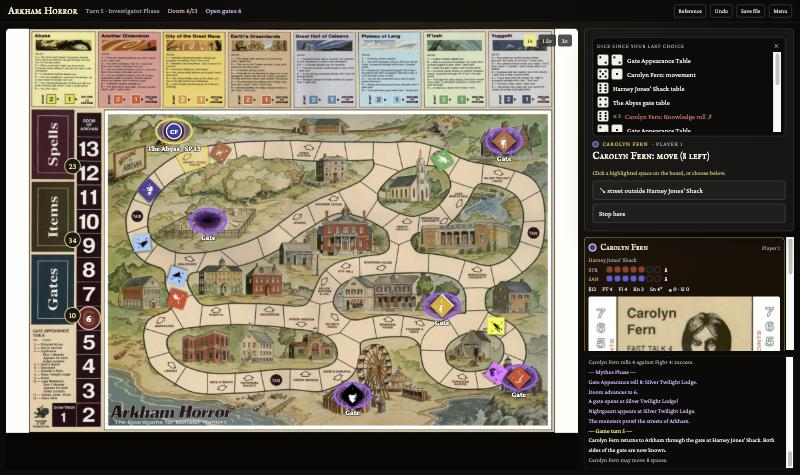
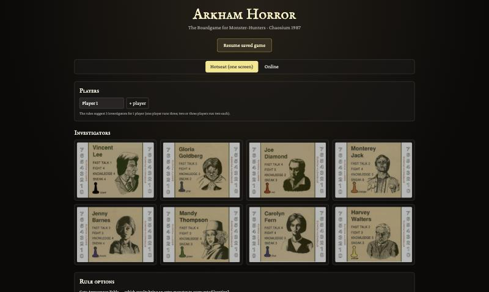

# Arkham Horror (1987)

A faithful digital recreation of Chaosium's 1987 board game **Arkham Horror** — *The Boardgame for
Monster-Hunters*. Play hotseat on one screen or online with friends, on the original board with the
original cards, counters and investigator sheets.



The rules, tables and components were transcribed from the scanned rulebook, Gazette, cards and counter
sheets in [`ENG/`](ENG/), with the published errata applied. Where the source material disagrees with
itself, the choice is a game option rather than a guess.

> **Personal use only.** The artwork and text are © 1987 Chaosium Inc. This project is a fan recreation,
> is not affiliated with or endorsed by Chaosium, and is not for distribution.

---

## Contents

- [Quick start](#quick-start)
- [Playing](#playing)
- [Playing online](#playing-online)
- [Rule options](#rule-options)
- [What is implemented](#what-is-implemented)
- [How it works](#how-it-works)
- [Development](#development)
- [Deployment](#deployment)
- [Project layout](#project-layout)
- [Known gaps](#known-gaps)

## Quick start

Requires **Node.js 20+** (22 LTS recommended).

```bash
npm install
npm run dev
```

Open <http://localhost:3000>, choose your investigators and press **Begin the investigation**.

## Playing



1. **Set up.** Name the players, then click investigator sheets to bring them into the game. Assign each
   to a player and split 10 points between Strength and Sanity (3–7 each). The rules suggest three
   investigators for one player and two each for two or three players.
2. **Play.** Every decision the rules ask for appears in the panel on the right: move or wait, which
   street to take, buy or decline, fight or sneak, which weapons and spells to use. When a choice is a
   place on the board, the valid spaces light up and you can click them directly.
3. **Win** by closing every gate (from the second game turn on). **Lose** if too many gates stay open for
   a full game turn (8 for 1–3 investigators, 7 for 4, 6 for 5+) or if the Doom track passes 13.

Handy controls:

| Control | What it does |
| --- | --- |
| Click a card, counter or investigator sheet | Enlarge it (counters show front and back) |
| **Reference** | Rules digest, every location and Other World table, all 49 monsters, all cards |
| Dice tray | Every roll since your last decision, with target and ✓ / ✗ |
| **Undo** | Step back one decision (hotseat; host only online) |
| **Save file** / **Load save…** | Download the game as a small JSON file and load it later |
| 1× / 1.5× / 2× | Zoom the board |

Hotseat games autosave in the browser; **Resume saved game** on the start screen picks up where you left
off. The layout works on phones and tablets, with the decision panel docked at the bottom.

## Playing online

For local testing run the room server and the app side by side:

```bash
npm run dev:server   # room server on :3001
npm run dev          # app on :3000 (forwards /ws to the room server)
```

1. Choose **Online** on the start screen, enter your name and set up the game as usual. Each name under
   *Player seats* is a seat; investigators belong to seats.
2. Press **Host online game**. You get a five-letter **room code** — click it in the header to copy an
   invite link.
3. Everyone (the host too) opens the link or enters the code under *Join a game*, then **takes** one or
   more seats. You can also just watch.
4. Each decision is made from the seat that owns the investigator; everyone else sees *Waiting for …*.
   Shared decisions, such as pointing a new monster's arrow, can be made by anyone seated.

Games survive page reloads, dropped connections and server restarts — players are put back in their seats
automatically. There is table-talk chat, the host can **Undo** and can free a seat if a player leaves.

> Rooms are protected only by their code: anyone with the code can join and take a free seat. Share codes
> with the people you're playing with, not publicly.

## Rule options

Chosen on the setup screen.

| Option | Default | Source |
| --- | --- | --- |
| Gate Appearance Table: extra monster on every gated location on **7** (rules sheet) or on **4 and 10** (game board) | Rules sheet | The two printings disagree |
| Players point each new monster's arrow (off: random heading) | On | Rules: "Head the arrow in its direction of movement" |
| Failing a Fast Talk while bargaining raises the price by $1 | Off | Rulebook OPTION |
| Investigators fighting in the same space each get +1 Fight | Off | Rulebook OPTION |
| A lost investigator can be rescued from an Other World | Off | Rulebook OPTION |
| Strength limits how many items you can carry | Off | Rulebook OPTION |
| First Citizen decided by total SP of gates closed | Off | Rulebook OPTION |

## What is implemented

**Components**
- The full board traced from the scan: 68 street spaces, 3 taxi stands, 26 locations with their entrances
  (including the three back doors), and turning directions at every intersection.
- All 26 location tables and 8 Other World tables, every result scripted, not just displayed.
- 49 monster counters with movement, strength, sanity and special abilities, errata applied.
- 37 item cards, 24 spells, 8 skills, 16 gates, 4 retainers, 2 local characters, charity cards and the
  8 investigators.

**Rules**
- The full turn: retainer pay, moving, taxis and free rides, encounters, meeting monsters, sneaking,
  fighting, hospital, sanitarium and jail.
- Combat with Fight, weapons and spells, the two-hand limit, sanity rolls once per monster per turn,
  Only Magic Harms It, Weapons Do 1 Point Damage, the silver bullet, Flesh Ward, local characters and the
  Piccolo of Leng.
- The Mythos phase: gate appearance, the doom track, vampires growing, handed monsters turning at
  intersections, flyers hunting the nearest investigator, Hounds of Tindalos, and monsters attacking.
- Other Worlds (box 2, box 1, home), finding both sides of a gate, closing gates, guardians, the colour
  purge, Elder Signs, Dragon's Eye and Blue Watcher, Find Gate, Nightgaunts and the Silver Key.
- Bind Monster (banish, or bind it to fight for you), shops and Fast Talk bargaining, selling items,
  auctions (cash or items), Dagon charity and repayment, two-way trading, lost investigators and
  replacements, and the Roll of Honor.

## How it works

The rules engine ([`src/engine/`](src/engine/)) is plain TypeScript with no UI code. A game runs as a
generator: whenever a player has to decide something, it pauses and asks; the interface shows the
question and sends back the answer. Dice come from a seeded random generator, so a whole game is fully
described by its **setup plus the list of answers**.

That one property gives several features for free:
- **Save files** are just setup + answers, a few kilobytes.
- **Undo** replays all answers but the last.
- **Online play** sends only answers. The server keeps the real game, checks each answer (is it this
  player's turn, do they hold the seat, is the choice legal) and relays it; every browser replays it with
  the same engine and stays in step.

## Development

```bash
npm run dev          # app with hot reload on :3000
npm run dev:server   # room server for online play on :3001
npm test             # all tests
npm run lint         # type-check
npm run build        # production build into dist/
```

The tests cover:
- **Rules scenarios** — combat immunities, gates and guardians, the Elder Sign, doom and defeat, both
  gate-table variants, Bind Monster, the Silver Key, auctions, trading, rescue and the carrying limit.
- **Random play** — 150 complete games with random options and random legal choices, checking invariants
  and that replaying a save gives exactly the same game.
- **The server** — a two-player game over real WebSockets: seats, turn permissions, illegal and stale
  answers, undo, chat and reloading rooms after a restart; plus the static-file server.

### Regenerating assets

The images in `public/assets/` and the board graph are generated from the PDFs:

```bash
python3 -m venv .venv && .venv/bin/pip install pymupdf pillow
.venv/bin/python tools/extract_assets.py   # board, cards, counters, investigator sheets
python3 tools/genboard.py                  # src/engine/data/boardData.ts from tools/graph.json
```

## Deployment

One Node process serves both the built app and the online rooms on a single port.

```bash
npm ci
npm run build
npm start            # PORT (default 3001), DATA_DIR (default data/rooms)
```

Or with Docker — mount a volume at `/data` so games persist:

```bash
docker build -t arkham .
docker run -p 8080:8080 -v arkham-data:/data arkham
```

Any host that runs a Node container with WebSockets will do (Fly.io, Render, Railway, a VPS). Put it
behind HTTPS; the app switches to `wss://` automatically. To host the app separately from the server
(for example on static hosting), build it with `VITE_SERVER_URL=wss://your-server/ws`.

## Project layout

```
ENG/                  scanned rulebook, Gazette, cards, counters, board (source material)
public/assets/        artwork extracted from the scans
src/engine/           rules engine — no UI code
  data/               transcribed tables and components
  board.ts            street graph, movement, intersections, flyer paths
  game.ts             the rules, as a generator of decisions
  session.ts          replay, validation, save/load, undo
src/net/              online protocol and the remote client
src/ui/               React interface
server/               room server (Node + ws) and its tests
tools/                asset extraction and board graph generation
docs/RULES_NOTES.md   rules digest the engine follows
docs/WORKPLAN.md      plan, status and rule decisions
```

## Known gaps

Tracked in [docs/WORKPLAN.md](docs/WORKPLAN.md):
- The Silver Key can only bring you back to Arkham if you used it to leave; entering the Dreamlands
  through a gate and leaving by the key isn't supported.
- When several monsters move into one space, which monster attacks which investigator is approximated
  (strongest monster against highest Fight).
- Attacks between investigators aren't modelled.
- There is no computer player for empty seats yet.
